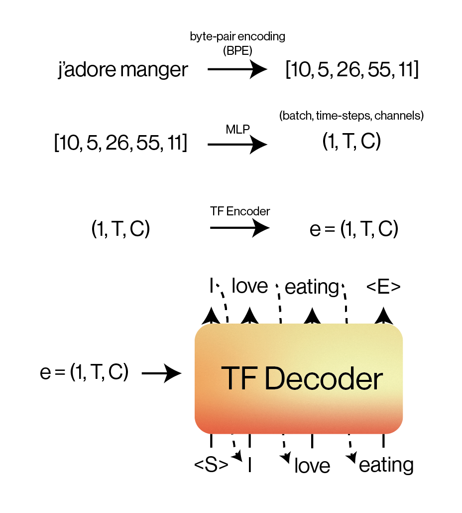
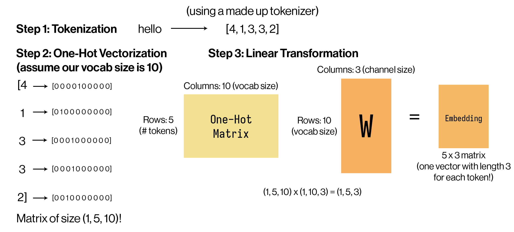
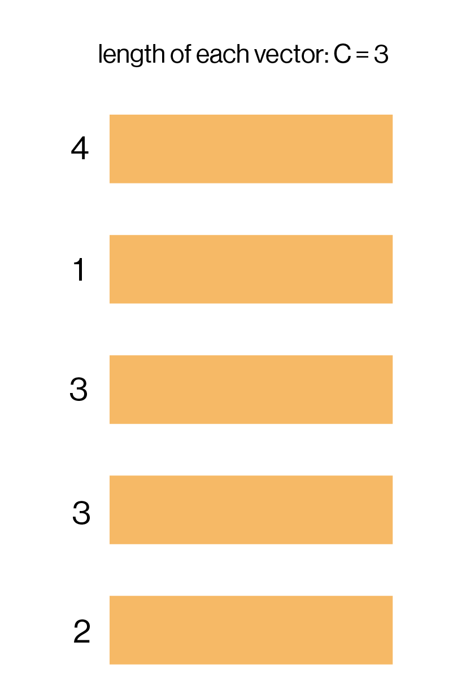
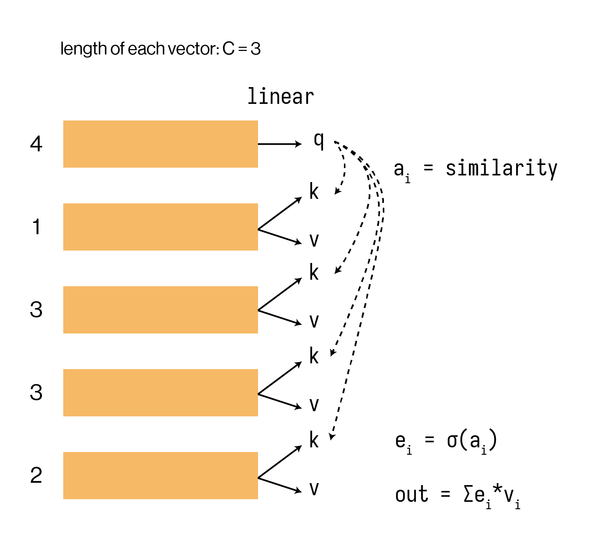
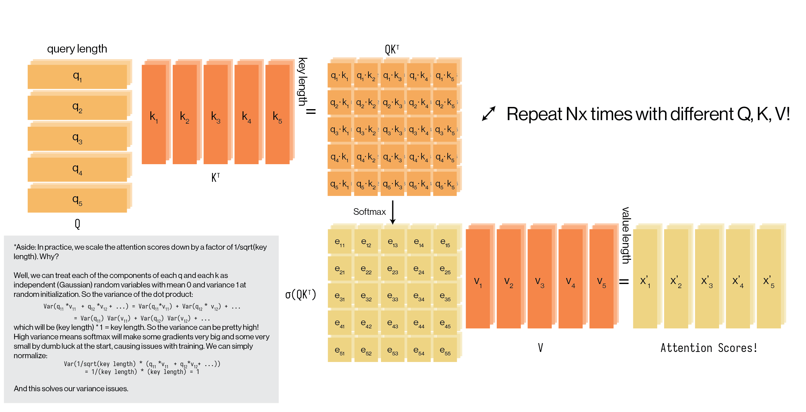
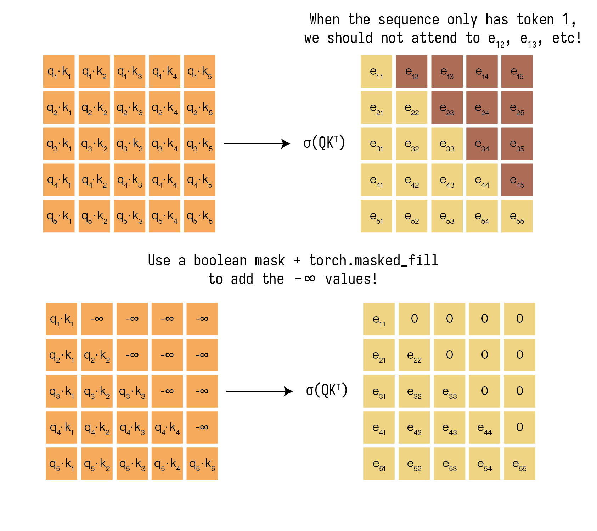
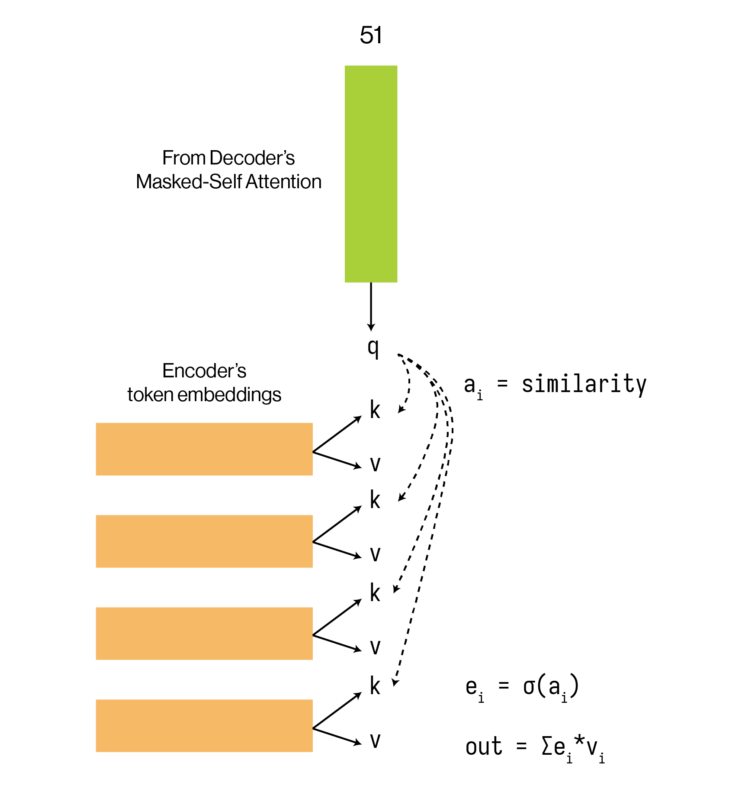

# Overview

## Problem

### Neural Machine Translation (NMT)

Consider machine translation, where we want to translate French into English.
In this case, we have a large dataset of text pairs: French sentences and the corresponding English sentences.

French:

```
Mon Dieu, nous avons trop d’Adityas dans le club.
```

English:

```
God, we have too many Adityas in the club.
```

We'll use a classic encoder-decoder architecture to tackle this problem.

1. Convert natural text (raw French and English) into tokens that our Transformer model can understand.
2. Encode each French token into an embedding (e.g. using an MLP).
3. Encode the full token embedding again using the Transformer encoder.
4. Use the Transformer decoder and the encoder embedding to autoregressively generate the English translation.

<div>

</div>

### Language Modeling (LM)

We'll also use our Transformer to build GPT (Generative Pretrained Transformer)! The original GPT-2
and GPT-3 are actually very similar to what we'll be making, which is a *language model*.

A language model tries to mimic and understand how humans produce natural language (*modeling language*).
In general, modeling typically means a probability model, so we'll be working on the next token prediction task.

```
The cow jumped over the ______
```

Here, we have all this rich context preceding our blank line, which is how we know that "moon" should
be the last word here. Internally, we have a sense of what words are most probable given a certain context
(whether that be forward or backward).

## Tasks

We'll build one model with all the pieces for both the French $$\to$$ English translation task and 
the language modeling task. Here are the steps we will take:

1. Tokenization (character-level and byte-pair encoding)
2. Transformer Encoder
3. Transformer Decoder
4. Training scripts for our NMT and LM tasks (we'll train NMT for French to English and an LM on movie screenplays)
5. Train our models!

# Setup

Beware! This homework doesn't have much scaffolding in code. We'll walk through each part of the 
architecture conceptually in depth, but we'll leave it up to you on how you will implement this in code.

## Scaffolding

To get started with the scaffolding, you should:
1. **Fork** the [repository](https://github.com/mlberkeley/fa25-nmep-hw4) (click the "Fork" button 
    at the top right of the GitHub page).
2. Add your partner's GitHub account as a collaborator. In your forked repository, go to 
    Settings $$\to$$ Collaborators and teams $$\to$$ Add people.
3. Clone your forked repository in `honeydew`.

    ```bash
    ssh honeydew
    git clone git@github.com:[your-username]/fa25-nmep-hw5.git
    cd fa25-nmep-hw5
    ```

    You can either choose to work in an editor like VS Code that supports SSH or
    a terminal-based editor like Vim or Neovim.

4. Install `uv` (`uv` is a modern, faster Python environment manager like `conda`)

    ```bash
    curl -LsSf https://astral.sh/uv/install.sh | sh
    uv sync # this will add a virtual environment and sync all the dependencies
    source .venv/bin/activate # this will activate the venv we just created
    ```

5. You're going to be working in the `seq2seq` directory (which is built like a
    Python library). To work with our Python module while editing it, we'll pip install
    it.

    ```bash
    uv pip install -e . # -e means editable, . means in the current directory: the `seq2seq` module defined in `pyproject.toml`
    ```

6. Next, let's make sure we have all the data we need. We'll use the [EuroParl dataset](https://www.statmt.org/europarl/) for
    paired French-English sentences.

    ```bash
    # make sure you're in the fa25-nmep-hw5/ directory
    curl -L https://www.statmt.org/europarl/v7/fr-en.tgz --output data/nmt/fr-en.tgz # nmt stands for neural machine translation
    mkdir data/nmt/europarl
    tar -xvf data/nmt/fr-en.tgz -C data/nmt/europarl/
    ls data/nmt/europarl/
    ```

    You should see `europarl-v7.fr-en.en` and `europarl-v7.fr-en.fr` in the `ls` results. You can use the `head -n 5 [filename]` command
    to view the first few lines of each file. You'll see that the lines correspond to paired sentences.

    For the LM task, we've given you the movie screenplays in the `data/lm/` folder:

    ```bash
    ls data/lm/
    ```

    You'll see many `.txt` files. Each contains a screenplay from a famous movie from [IMSDB](https://imsdb.com/).
    Since there isn't too much data here, our trained LM won't be very coherent, but will eventually output something
    looking vaguely similar to these screenplays.

## Structure

You're set up! Here's how the project is structured:

```bash
├── data
│   ├── lm
│   │   ├── *.txt
│   │   ├── README.md
│   └── nmt
│       └── europarl
├── pyproject.toml
├── README.md
├── requirements.txt
├── ruff.toml
├── scripts # here, we use our implementation to train or test or models.
│   ├── decode_lm.py
│   ├── decode_nmt.py
│   ├── train_lm.py
│   └── train_nmt.py
├── seq2seq
│   ├── __init__.py
│   ├── data # how we import our data into PyTorch Datasets of Tensors.
│   │   ├── __init__.py
│   │   ├── fr_en.py
│   │   └── screenplay.py
│   ├── tokenizer # our character-level and byte-pair encoding tokenizers.
│   │   ├── __init__.py
│   │   ├── bpe_tokenizer.py
│   │   ├── character_tokenizer.py
│   │   └── tokenizer.py
│   └── transformer # our core architecture implementation
│       ├── __init__.py
│       ├── attention.py
│       ├── decoder.py
│       ├── encoder.py
│       └── transformer.py
├── tests # simple shape-based tests
│   ├── test_tokenizer
│   │   ├── __init__.py
│   │   └── test_character_tokenizer.py
│   └── test_transformer
│       ├── __init__.py
│       ├── test_attention.py
│       ├── test_decoder.py
│       ├── test_encoder.py
│       └── test_transformer.py
└── uv.lock
```

## Testing

We provide you with a few simple test for sanity-checking your
implementation. This does NOT guarantee that your Transformer
implementation is correct, but can provide some information about
whether your shapes are at least lining up. Run all tests with:

```bash
cd fa25-nmep-hw5 # make sure your uv venv is activated
python -m unittest discover tests
```

or run a specific test file with

```bash
python -m unittest tests/[folder]/[test_file].py
```

# Tokenization

Let's start working! Our first step will be to build a tokenizer.
Remember that we're working with natural language, which is largely
text-based inputs. Similar to how we convert our images to
a number-based representation for our CV models, we will convert our
text-based inputs to number-based representations as well: tokens.

There are many different tokenization schemes. In this homework, we'll
explore two: character-based tokenization and byte-pair encoding (BPE).

## Character Tokenization

At its core, tokenization is a process that takes a string of text:

```
Dasari? Is that like the water brand?
```

and converts it into a list of integers that we call tokens:

```
[15, 42, 11, 254, 2, 32, 68, 99, 11]
```

How do we map our input text to integers? One option is to assign
a number to each **character**:

$$
a \to 0\\
b \to 1\\
c \to 2\\
d \to 3\\
\dots
$$

Then, to tokenize our input, we simply iterate over the string
character by character, and output the corresponding token index
every time.

$$
D \to 7\\
a \to 0\\
s \to 30\\
\dots
$$

```
Dasari? Is that like the water brand?
[7, 0, 30, 0, 29, 16, 56, 94, 16, 30, 94, 31, 15, 0, 31, 94, 21, 16, 20, 8, 94, 31, 15, 8, 94, 37, 0, 31, 8, 29, 94, 4, 29, 0, 23, 7, 56]
```

Time to implement this ourselves! In `seq2seq/tokenizer/character_tokenizer.py`,
you'll see a `CharacterTokenizer` class. Your first task is to implement this tokenizer.
Your subtasks are:
1. Fill the `self.vocab` dictionary with our mapping of $$\text{char} \to \text{index}$$ (so the keys of `self.vocab`
    will be all the characters from `self.characters`, and the values will be indices starting from $$0$$).
2. Implement the `encode` function, which will take a string text and output a `Tensor` containing a list of token indices.
3. Implement the `decode` function, which will take a `Tensor` containing a list of token indices and return the original string.

After implementing your tokenizer, test with:
```bash
python -m unittest tests/tokenizer/test_character_tokenizer.py
```

## Byte-Pair Encoding (BPE)

While character-based tokenization is a valid way of encoding your text, it has limitations. In particular, each character
doesn't have any specific meaning inherently attached to it. If we see words like "old", "older", and oldest", it would help
to repeat a single token for "old" that allows models to see that these words are related. Additionally, 
character-based tokenization leads to very, *very* long sequences, which will eventually require more compute to process. 

But if we went to the other extreme and tried to give every English word a separate token, our vocab size would be huge (!)
and we still run into the "old"/"older" problem. Byte-pair encoding tokenizes *subwords* to strike a balance between the two, 
where "old" and "older" might share a subword token for "old", with another token for "er".

We don't require you to implement BPE, but here's how it works conceptually: we will iteratively replace the most commonly
occuring sequence with a new token.
1. You have a large corpus of data you would like to build your BPE with.
2. You start with one token for each unique byte in our data. Assume we start with 100 tokens.

    ```
    Dasari? Is that like the water brand?
    [7, 0, 30, 0, 29, 16, 56, 94, 16, 30, 94, 31, 15, 0, 31, 94, 21, 16, 20, 8, 94, 31, 15, 8, 94, 37, 0, 31, 8, 29, 94, 4, 29, 0, 23, 7, 56]
    ```

3. Now, we sweep through the data for all pairs of tokens and note down which pair occurs most frequently. In this case, `[0, 31]`
    corresponding to `at` occurs most frequently, so it'll become the 101th token $$a t \to 101$$.
4. We retokenize our original data with our new vocab, and repeat the process until we reach a desired vocab size or until there
    are no pairs of tokens that occur more than once.
5. At the end, we have a bigger vocab than just the characters:

$$
a \to 0\\
b \to 1\\
\dots\\
at \to 101\\
\dots
$$

## Takeaway

Tokenization enables us to encode our textual inputs into a number-based representation. Important things to note:
1. When we want to batch our sequences for training, we need to make sure all of the sequences are the same length.
    If the maximum-length sequence in our batch has length $$L$$, then we will *pad* our remaining sequences with
    a special pad token `[PAD]`, which has some token index like `50267`. This is handled for you in the given
    `Dataset`s.
2. To denote when our sequences start and end, we'll add additional special tokens at the start and end for
    `Start Of Sequence` and `End of Sequence`: `[SOS]` and `[EOS]` respectively (also included for you).

With batching, our sequence shape has now been converted as:

$$
\text{input text} \to (B, T)
$$

where $$B$$ denotes batch size and $$T$$ denotes "time" or "# of tokens". You should interpret this as: we have
$$B$$ sequences of length $$T$$.

# Embedding

From our tokenization, we have a tensor representation for any arbitrary French or English input. 
Now here comes the fun part - we want to create an embedding for our text. As a reminder, an embedding 
is some sort of tensor that contains all the essential information about our text. 

Generally, this will be in a shape like $$(B, T, C)$$, containing the batch size ($$B$$), 
the number of time-steps ($$T$$), and the number of channels ($$C$$). What does this mean? Well, let’s break it down:

Batch size and time-steps we know from the previous step.
Number of channels ($$C$$) gives us the length of each embedding. We can choose this to be 256, 512, 
or really any number - powers of two are common ones for efficient computation.

To be very clear, this means that for every token, we have a $$C$$-length vector that represents it. 
At the start of our model, we don’t have any contextual information. So compute an embedding, we just use a linear transformation!

Let’s take a look at an example to make this explicitly clear:

Word to embed: “hello”
1. Batch size: 1 (we only have one input text to embed)
2. Number of time-steps: 5 (this is the length of our tokenized word, which has 5 characters)
3. Number of channels: 3 (this is the length of each embedding vector, chosen by us!)

<div>

</div>

## `nn.Embedding` Simplification

If we look closely at the matrix multiplication, we can notice that for each token, 
the “multiplication” is just choosing the column in W corresponding to that token!

So, this “linear transformation” is just a lookup table, where we have 
$$V$$ vectors (V being the vocab size), and we look up the vector for each token and pile them together in a $$T \times C$$ matrix. 
This is so common that PyTorch provides us with a `nn.Embedding` object that creates the differentiable lookup table for us!

At the start of our model, all of these $$V$$ vectors 
contain completely random numbers, and through gradient descent come to represent important information about our tokens.

As a summary, using an Embedding layer, we’ve converted our tokens into token embedding vectors containing token information. 
We are ready to build our Transformer now!

Shape progress:

$$
\text{Tokenize: }\text{input text} \to (B, T)\\
\text{Token Embeddings: } (B, T) \to (B, T, C)
$$

# Transformer

Remember that our translation task has two steps:
1. Encode all the information from our French input.
2. Use this encoded information to autoregressively generate an English translation.

So, let’s first focus on encoding the French input. At this point, we’ve tokenized the French, then created an embedding for it.
We consider our input to the Transformer Encoder to be $$(B, T, C)$$ and the Transformer Encoder will spit out an output 
of the same shape $$(B, T, C)$$! While going through the Transformer Encoder, each embedding has gathered contextual information
from surrounding tokens (by *attending* to them). Let's take a look at how this attention process works and implement it.

## Attention

The goal of attention is to learn contextual information about this token based on all other tokens. 
Recall what our embeddings look like:

<div>

</div>

Also recall what our goal is: for each embedding, we want to *search up* related embeddings 
and extract the most important information from them.

Our YouTube analogy is apt! If I want to watch a Mario Kart video on YouTube, I’ll use a query “Mario Kart gameplay”, 
which will check how similar my query is to a bunch of YouTube titles, which we call keys, 
and each title has a video value associated with it.

<div>

</div>

How do we replicate this hash table idea with our embeddings? Well, we use our handy linear transformation tool 
and just learn (in the machine learning sense) how to make queries, keys, and values!

<div>

</div>

If we do this for every embedding (see below), we’ll again end up with 5 "out" embeddings, each of which is a weighted 
sum of our values. If you understand this, you know exactly how the entirety of attention works. 
Now, just like how we use many kernels in a CNN, we’ll apply this process on these embeddings many times 
(this is where the "multi-head" term comes from).

<div>

</div>

And this is where we get our full scaled dot-product attention equation from the paper:

$$
\text{attention} = \frac{\sigma(Q K^\top)}{\sqrt{\text{qk}\_\text{length}}} \cdot V
$$

After this diagram, we’ve covered scaled dot-product attention and multi-head attention blocks as described in the 
Attention Is All You Need paper. You’re ready to implement them yourselves!

Task: Implement the full Transformer Encoder.
Subtasks:
1. Implement all parts of `MultiHeadAttention` in `seq2seq/transformer/attention.py`. This includes: `__init__`, `split_heads`, `combine_heads`,
    `scaled_dot_product_attention`, `forward`. 
    Follow the paper closely and use the diagrams for guidance. An implementation of positional encoding is provided for you. 
2. Implement the `FeedForwardNN` in `seq2seq/transformer/attention.py`. All this entails is adding two `Linear` layers
    that transform your embeddings of size $$(B, T, C)$$ to some intermediate shape $$(B, T, \text{hidden\_dim})$$ with
    a `ReLU` operation, then transforming them back to $$(B, T, C)$$.
3. Implement the `Encoder` in `seq2seq/transformer/encoder.py`. You'll need the modules from `attention.py`. In particular,
    implement `EncoderLayer` and then `Encoder`.

After this step, run:

```bash
python -m unittest tests/transformer/test_encoder.py
```

You should be passing all these tests (these are purely sanity checks, not correctness checks, which will come during training).

Shape progress:

$$
\text{Tokenize: }\text{input text} \to (B, T)\\
\text{Token Embeddings: } (B, T) \to (B, T, C)\\
\text{Encoder: } (B, T, C) \to (B, T, C)
$$


## Decoder

Great! We've successfully encoded all the information from our French input into a set of contextual embeddings $$(B, T_{\text{enc}}, C)$$

Now, we need to use this encoded information to autoregressively generate an English translation. This is the job of the Decoder.

The Decoder is also a stack of layers, just like the Encoder. However, it's a bit more complex because it has to manage two different inputs:

1. The Encoder's output embedding: This is the fully contextualized French sentence (our $$(B, T_{\text{enc}}, C)$$ tensor). 
    This is where the Decoder *gets its information* about what to translate.

2. The target sequence: This is the English translation generated so far. For example, if we're translating 
    "Je suis un" to "I am a", and we want to predict the *next* word ("student"), we feed 
    "I am a" $$(B, T_{\text{dec}}, C)$$ into the decoder as the "target sequence".

The Decoder's job is to take these two inputs and produce an output $$(B, T_{\text{dec}}, C)$$
that represents the *best* prediction for the *next* token at each position.

## Attention Modifications for Decoding

In the decoder, we have to make some modifications to our attention mechanism: masked-attention and cross-attention.

1. Masked Multi-Head Attention (Self-Attention): This first attention block operates on the *target* (English) embeddings. 
    It's almost identical to the Encoder's self-attention, with one crucial difference: we must prevent the decoder from 
    "cheating" by looking at future tokens.

    When we're at position $$i$$ (e.g., trying to predict the word after "am"), we should only have access to tokens at 
    positions $$\le i$$ ("I", "am"). We can't look at position $$i+1$$ ("a"), because we're trying to predict it!

    We accomplish this by applying a *look-ahead mask* to the attention scores 
    (the $$Q K^\top$$ matrix) *before* the softmax. This mask sets all values corresponding to future positions to $$-\infty$$.
    Remember what the softmax function looks like! If we want attention scores for future tokens to be zero *after* the softmax,
    we must set their output after the $$Q K^\top$$ matrix to be $$-\infty$$.

   <div>
   
   </div>

   One other place where we need to use this masking is to mask out our pad tokens. Remember that we add our pad tokens
   when batching multiple sequences together of varying length. If we allow the encoder and the decoder to attend to
   pad tokens, these tokens will end up dominating our training and lead to divergent models.

   The functions to create boolean causal and pad masks for the encoder and decoder are provided
   in `seq2seq/transformer/transformer.py` as `make_pad_mask` and `make_causal_mask`.

2. Cross-Attention (Encoder-Decoder Attention): Remember that self-attention allows us to attend to tokens within
    our own sequence. For the Decoder, we also want to look at the French input by attending to the French embedding
    from the Encoder..

   Recall our YouTube analogy. Now, the Query ($$Q$$) comes from the output of our *Decoder's* masked self-attention (from step 1). 
   This $$Q$$ represents: "I am an English token, this is my context so far. 
   What information do I need from the French sentence to make my next prediction?"

   The Keys ($$K$$) and Values ($$V$$) come from the Encoder's output (the contextualized French embeddings). Remember
   that keys inform us about which values are relevant: keys and values are tied together and *must* originate from the
   same source.

   The Decoder's query ("I am a...") searches against all the French keys. It might find that its query is most similar to the 
   key for the "suis" token embedding while also attending to the other tokens, and it will then take a weighted sum of the 
   French *values* to produce its output. This is how it learns the alignment between the two languages.

   <div>
   
   </div>

Task: Implement the full Transformer Decoder.
Subtasks:

1. Modify `scaled_dot_product_attention` in `seq2seq/transformer/attention.py`. If you haven't added this yet,
    handle the optional mask argument. If this `mask` is provided, you must "fill" the attention scores 
    (the `matmul(q, k) / ...` result) with a very large negative number (like `-float('inf')`) at all positions where 
    the mask is `1`. This must be done *before* applying the softmax.

2. Implement all parts of the `Decoder` in `seq2seq/transformer/decoder.py`.

   * Implement `DecoderLayer`. This will involve creating instances of your `MultiHeadAttention` 
   (one for masked self-attention, one for cross-attention) and your `FeedForwardNN`. 
   Don't forget the three residual connections and `LayerNorm`s! You'll notice you are given both
   a `tgt_mask` and a `src_mask` here. `tgt_mask` has both the causal mask and the pad mask applied
   for the English input into the Decoder. `src_mask` has the pad mask applied to it.

       You'll need to think about where to input the `src_mask` vs the `tgt_mask` (hint: the only function
       that actually deploys any masks is the `scaled_dot_product_attention` function)

   * Implement `Decoder`. This will be a `ModuleList` of your `DecoderLayer`s, just like in the `Encoder`. 
   It will also need to handle the target embeddings and positional encoding. 
   Its `forward` method will be more complex, as it takes both the target sequence `tgt` and the `enc_x` (encoded French).

After this step, run:

```bash
python -m unittest tests/transformer/test_decoder.py
```

You should be passing all these tests. Once this is done, you have a full `Transformer`! We've implemented
the joining of the `Encoder` and `Decoder` for you in `seq2seq/transformer/transformer.py` (take a look!).

# Training

Once we are finished with our architecture, we want to implement our training loops for
both the NMT and the LM tasks.

## NMT Task

Fill in the `TODO` sections in `scripts/train_nmt.py`. 

1. You'll need to take a look at
`seq2seq/tokenizer/bpe_tokenizer.py` for details on what index to ignore.
2. Fill in the `tgt_output`. Think carefully about what should be the target input
    and target output for our model (hint: remember that the Decoder is autoregressive!)

## LM Task

We've implemented the LM training script for you! Just add the same line
that you added in the NMT task in the `TODO` line in
`scripts/train_lm.py`.

## Start training!

1. Set your devices to be different values (based on which GPUs
are free on honeydew according to `nvidia-smi`).
2. Train! You can run:

    ```bash
    tmux # open two different panes or two different tmux sessions
    uv run scripts/train_nmt.py
    uv run scripts/train_lm.py
    ```
    and your model should start training!

3. Checkpoints will start saving in your working directory. Once you have
    checkpoints, you can test your models with:

    ```bash
    uv run scripts/decode_nmt.py
    uv run scripts/decode_lm.py
    ```

    Take a look at these scripts. In both cases, we basically start with a `BOS` token,
    produce next token distributions, sample from them, and add to our list of
    accumulated tokens so far. If we either hit our `max_len` or an `EOS` token, we
    stop decoding! Feel free to explore different decoding schemes, including
    greedy, top-$$k$$, top-$$p$$ (nucleus), and beam search.

# Submission

Once you feel as though your model outputs are satisfactory when running the
decode scripts, feel free to submit:
1. On the HW 4 grading assignment, please submit the text outputs from
the `decode_nmt.py` and `decode_lm.py` scripts.
2. And you're done! You've successfully built and trained `Transformer`-based
models :)
